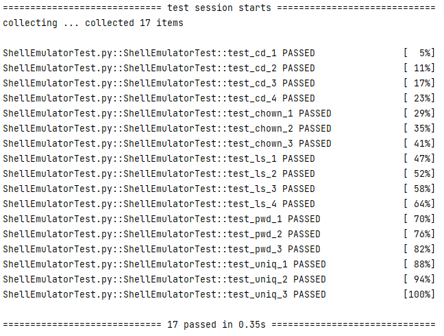
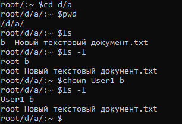
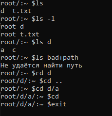
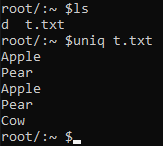
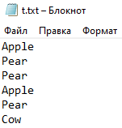

# Эмулятор терминала Linux
## Задание
Разработать эмулятор для языка оболочки ОС. Необходимо сделать работу 
эмулятора как можно более похожей на сеанс shell в UNIX-подобной ОС. 
Эмулятор должен запускаться из реальной командной строки, а файл с 
виртуальной файловой системой не нужно распаковывать у пользователя. 
Эмулятор принимает образ виртуальной файловой системы в виде файла формата 
tar. Эмулятор должен работать в режиме CLI.
Конфигурационный файл имеет формат xml и содержит:
• Путь к архиву виртуальной файловой системы.
Необходимо поддержать в эмуляторе команды ls, cd и exit, а также 
следующие команды:
1. pwd.
2. chown.
3. uniq.

Все функции эмулятора должны быть покрыты тестами, а для каждой из 
поддерживаемых команд необходимо написать 3 теста.
## Реализация
Эмулятор был реализован на языке Python в среде PyCharm. В разработке использованы модули tarfile для работы с архивом файловой системы, xml.etree.ElementTree для работы с xml-файлом конфигурации и pprint для вывода словаря с файлами пользователей - это дополнительная команда, с помощью которой может быть продемонстрирована работа команды chown.
## Тесты
На каждую команду были написаны 3-4 теста, которые демонстрируют работу команды при корректных и некорректных аргументах. Тесты были написаны с использованием модуля io, модуля unittest и декоратора patch из библиотеки unittest.mock.
## Скриншоты
### Тестирование

### Команды pwd и chown

### Команды lc, cd и exit

### Команда uniq

### Содержимое файла t.txt

